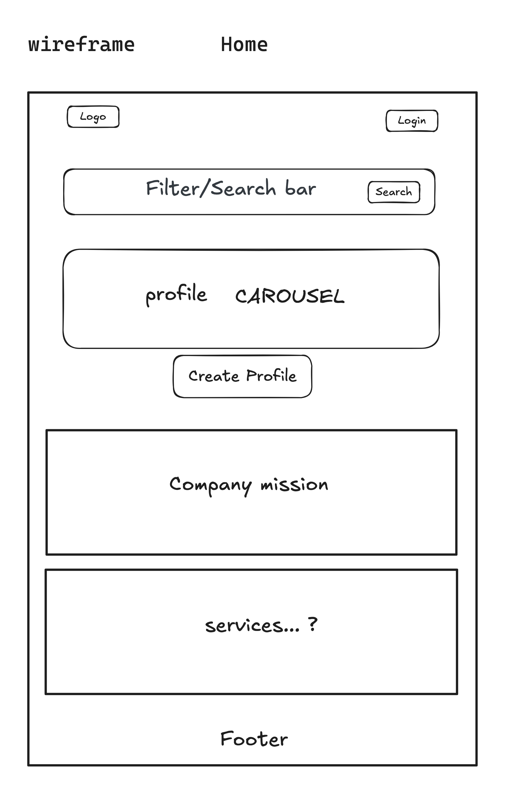
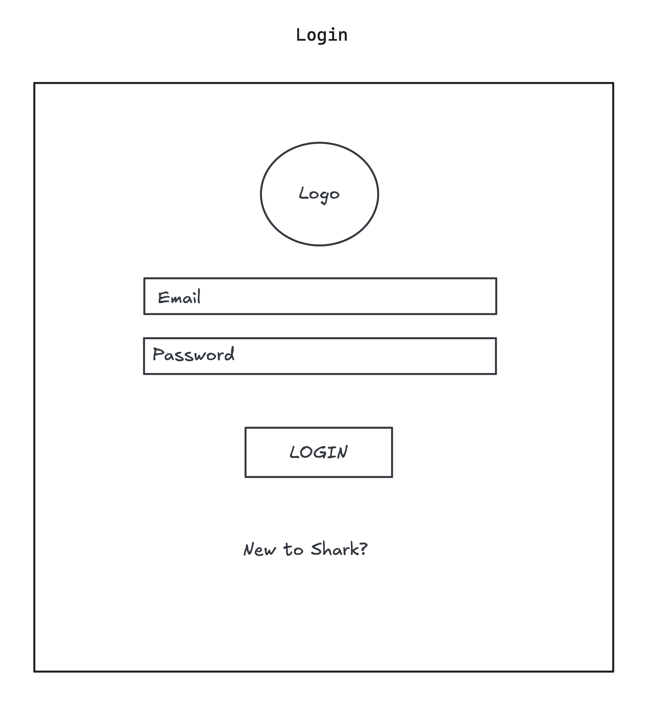
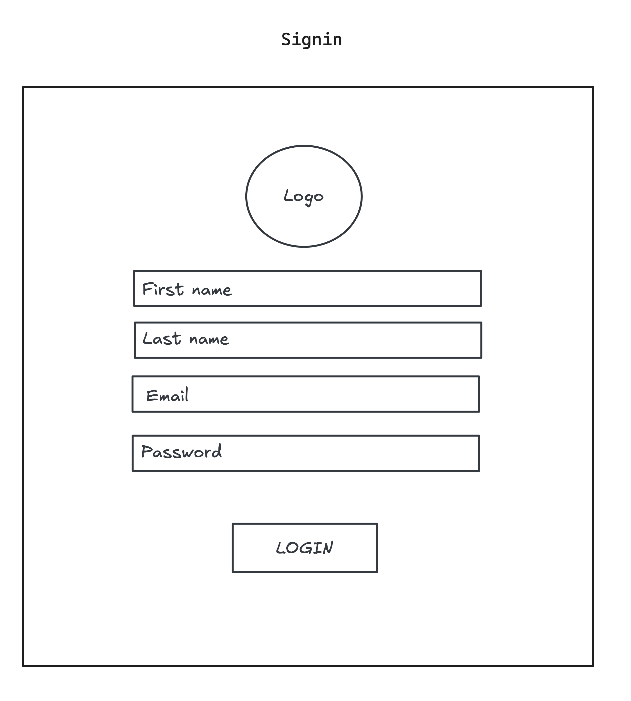
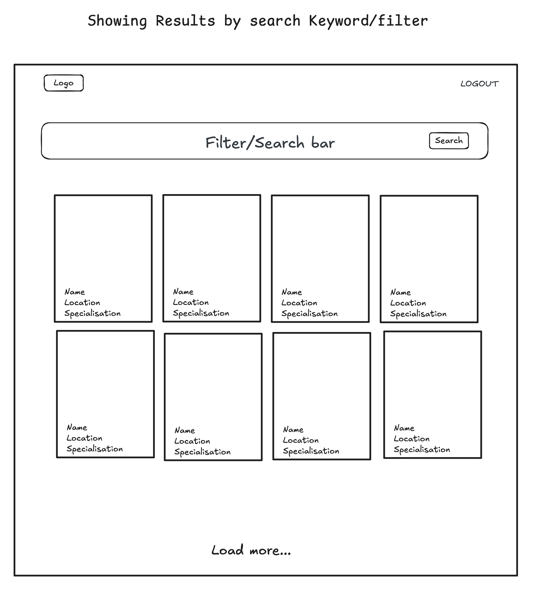
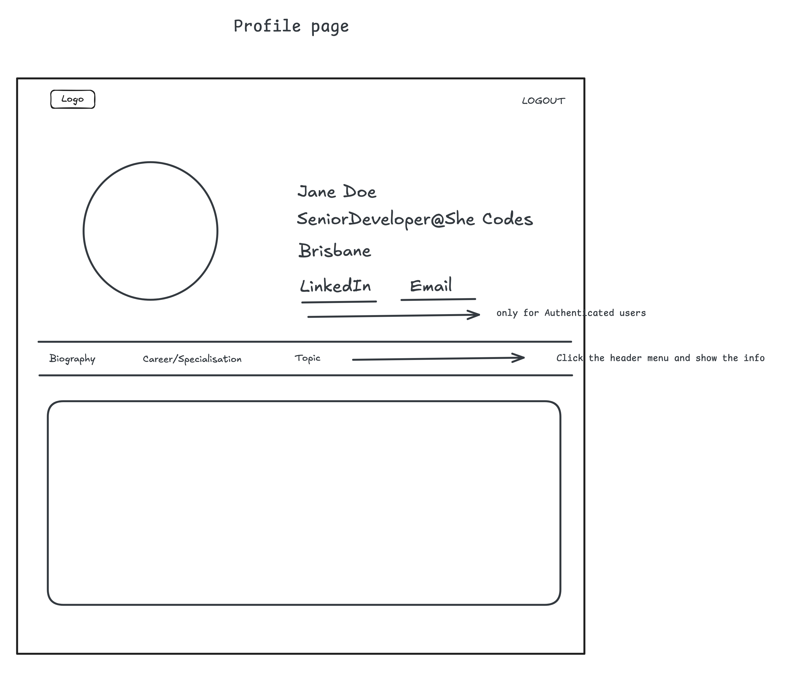
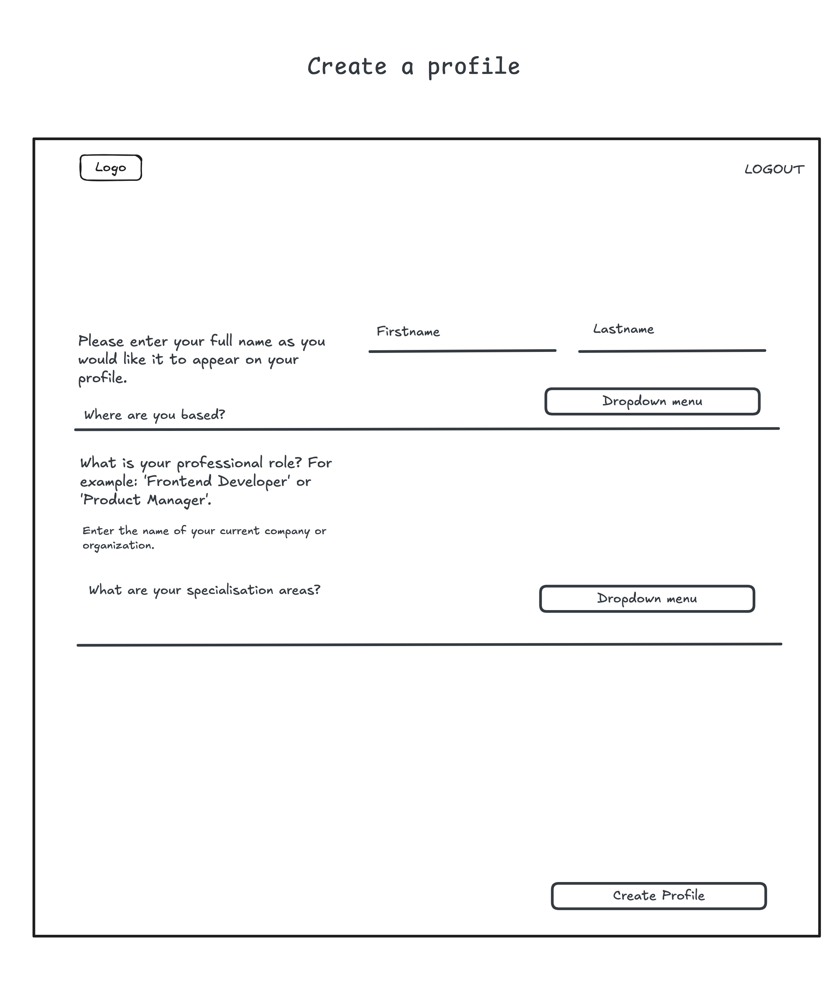
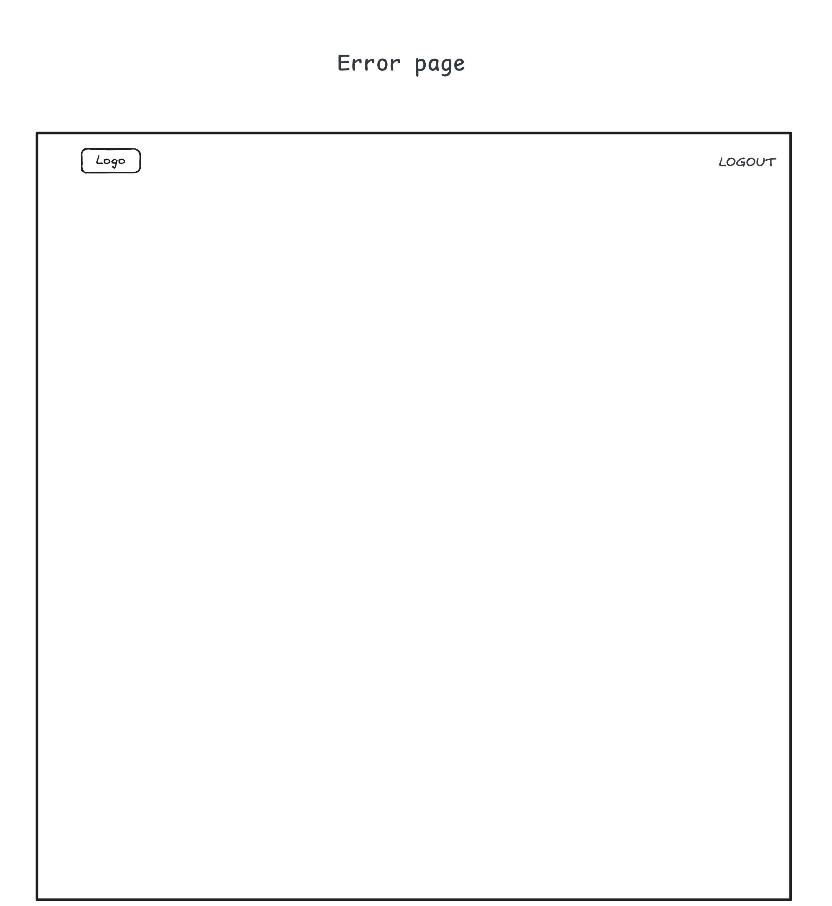
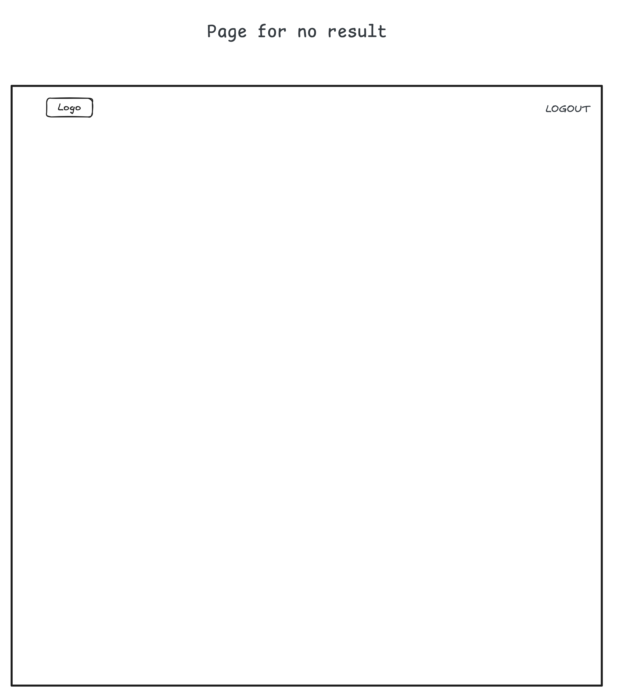
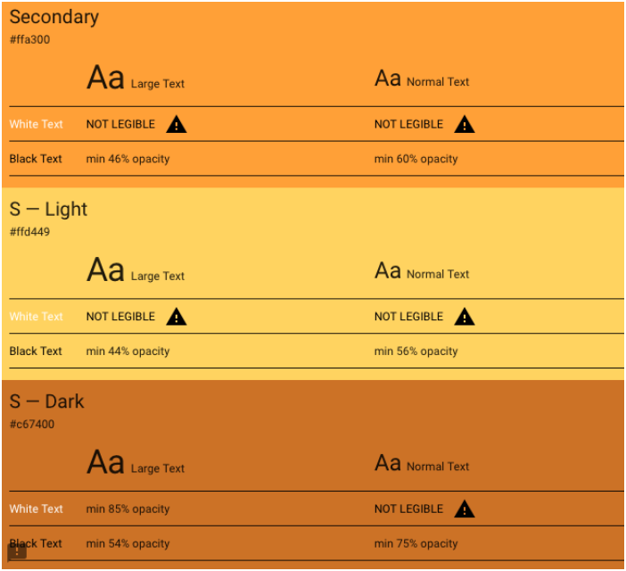

# Your Product Name
> Cyber Sharks

<!-- ## Table of Contents

- [Your Product Name](#your-product-name)
  - [Table of Contents](#table-of-contents)
  - [Mission Statement](#mission-statement)
  - [Features](#features)
    - [Summary](#summary)
    - [Users](#users)
    - [Sticky Notes](#sticky-notes)
    - [Collections](#collections)
    - [Pages/Endpoint Functionality](#pagesendpoint-functionality)
    - [Nice To Haves](#nice-to-haves)
  - [Technical Implementation](#technical-implementation)
    - [Back-End](#back-end)
    - [Front-End](#front-end)
    - [Git \& Deployment](#git--deployment)
  - [Target Audience](#target-audience)
  - [Back-end Implementation](#back-end-implementation)
    - [API Specification](#api-specification)
    - [Object Definitions](#object-definitions)
      - [Users](#users-1)
      - [Sticky Notes](#sticky-notes-1)
    - [Database Schema](#database-schema)
  - [Front-end Implementation](#front-end-implementation)
    - [Wireframes](#wireframes)
    - [Logo](#logo)
    - [Colours](#colours)
      - [Primary](#primary)
      - [Secondary](#secondary)
    - [Font](#font) -->


## Mission Statement

Empowering growth by connecting role models and opportunities in tech through a platform for collaboration and inclusivity.

## Features

### Summary
The web app will connect diverse individuals to panels and speaking opportunities by allowing:
- Profiles for speakers to showcase their experience and expertise
- Organizers to search and filter profiles effectively
- A user-friendly platform that balances accessibility and professionalism

### Users

| Type | Access | Role Type Assignment |
|------|---------|---------------------|
| Superuser/Admin | - Login, logout, and full profile management<br>- Verify and delete inactive profiles<br>- Update platform content<br>- Manage user accounts<br>- Access admin dashboard | Platform managers and administrators |
| Individual User | - Create and update personal profiles<br>- Claim or request profile deletion<br>- Login and logout<br>- Filter and search profiles | Role models, diverse professionals seeking opportunities |
| Guest User | - View profiles<br>- Search profiles but cannot contact without an account | Event organizers and general users exploring profiles |

### Collections

| Feature | Access | Notes/Conditions |
|---------|---------|-----------------|
| Profile Information | Admin, User | Name, title, role, specialization, experience levels (technical and speaking), location, bio, and contact |
| Profile Management | Admin, User | Profiles can be created by individuals or by nomination. Inactivity may lead to automatic deactivation |
| Search and Filter | Guests, Admin, User | Filter by specialization, location, experience levels |
| Profile Claiming | Admin, User | Users can claim a profile if created by someone else. Stretch goal for MVP |

### Pages/Endpoint Functionality

| Endpoint/Page | Functionality | Comments |
|--------------|---------------|-----------|
| Homepage | - Introduction to the platform<br>- Create profile<br>- Carousel of featured profiles<br>- Search and filter functionality | Responsive design for desktop-first users |
| Profiles | - Individual profiles with detailed information<br>- Continuous scroll for browsing profiles<br>- Search and filter functionality | Key feature of the MVP |
| Profile | - Display detailed speaker information<br>- Provide a "Contact Speaker" option (requires login)<br>- Allow users to search and filter profiles<br>- Allow guests to view profiles but restrict contacting | Key feature of the MVP. Profiles are searchable and filterable |
| Create profile | - Provide a form for users to input their details<br>- Allow admins to create or edit profiles for others<br>- Save profiles to the database<br>- Validate inputs | Users can update their profiles after creation |
| Signup Page | - Enable new user registration<br>- Validate email format and passwords<br>- Include CAPTCHA (optional)<br>- Redirect users to create profile | Email should be mandatory to activate an account |
| Admin Dashboard | - Manage all user and profile data<br>- Delete inactive profiles | Admin access only |
| Login/Signup | - Create accounts<br>- Manage login/logout | Required for contacting profiles |
| Profile Management | - Users can create and update their profiles<br>- Admin can verify or delete profiles | Separate profile creation from account creation |

### Nice To Haves

- Profile likes and connection counts
- Animations for improved user experience
- Responsive design for mobile use
- Claim profiles feature
- Allow guests to view profiles without contact access

## Technical Implementation

### Back-End

- Django / DRF API
- Python

### Front-End

- React / JavaScript
- HTML/CSS

### Git & Deployment
- Heroku
- Netlify
- GitHub

This application's back-end will be deployed to Heroku. The front-end will be deployed separately to Netlify.
 
We will also use Insomnia to ensure API endpoints are working smoothly (we will utilise a local and deployed environment in Insomnia).

## Target Audience

Our platform serves two primary audience segments:

**Primary Audience:**
- Event organisers in the tech industry looking for women speakers and role models in tech
- Women in tech or transitioning into tech roles, seeking speaking opportunities, and expand their network
- Students and minority folks looking for inspiration and role models

**Secondary Audience:**
- Professionals seeking to build their personal brand and expand their professional network
- Students and early career professionals exploring tech career paths

### User Personas

**1. Role Model - Dr. Emily Carter**
- Age: 37
- Occupation: AI Research Scientist
- Tech Specs: Machine Learning, AI
- Goals:
  - Build a personal brand as an expert in the tech industry
  - Inspire and mentor women in tech
  - Be discovered for speaking opportunities
- Challenges:
  - Limited time to manage outreach opportunities
  - Difficulty showcasing expertise effectively online
- Preferred Features:
  - Profile creation and editing tools
  - Privacy controls for contact preferences
  - Easy to use interface for highlighting expertise
- Quote: "I want to inspire others while continuing to grow my professional network."

**2. Event Organiser - Camila**
- Age: 42
- Occupation: Event Coordinator at TechTechy
- Event Focus: Tech Conferences and Webinars
- Goals:
  - Find diverse, qualified speakers for tech events
  - Streamline the speaker selection process
  - Ensure a professional and engaging event experience
- Challenges:
  - Difficulty finding speakers with specific expertise
  - Limited time for manual searches and outreach
- Preferred Features:
  - Advanced search filters (expertise, location)
  - Detailed speaker profiles with professional backgrounds
  - Contact tools for outreach and response tracking
- Quote: "I want to ensure our events feature speakers who inspire and engage the audience."

**3. Community Member - Priya Kapoor**
- Age: 24
- Occupation: Software Engineering Student
- Tech Interests: Frontend Development, UI/UX Design
- Goals:
  - Discover relatable role models in tech
  - Learn about different career paths and specialisations
  - Build confidence in pursuing a tech career
- Challenges:
  - Lack of access to diverse representation in the tech industry
  - Uncertainty about which specialisation to pursue
- Preferred Features:
  - Browse functionality for profiles and success stories
  - Insights into career paths and industry trends
  - Role models with relatable journeys
- Quote: "I want to explore tech career options and find role models who inspire me."

<!-- ## Back-end Implementation
### API Specification

| HTTP Method | URL                                 | Purpose                                                                                                                                  | Request Body                                                                                                       | Successful Response Code | Authentication and Authorization                      |
| :---------- | :---------------------------------- | :--------------------------------------------------------------------------------------------------------------------------------------- | :----------------------------------------------------------------------------------------------------------------- | :----------------------- | :---------------------------------------------------- |
| POST        | /login                              | Allow users to log in                                                                                                                    | ““Username”:”string”, “password”:”string”                                                                          | 200                      | Token auth                                            |
| POST        | /logout                             | Allow users to log out ( end active session)                                                                                             | ““Username”:”string”, “password”:”string”                                                                          | 200                      | Will clear user log in session \- remove stored token |
| POST        | /Register                           | Create new student or approver user                                                                                                      | “Username”:”string”, “FullName”: “string” “Email”:”string”,”Password”:”string”, ”Password2”:”string”,              | 201                      | Admin                                                 |
| PUT         | /Profile/ID                         | Edit user                                                                                                                                | “Username”:”string”, “FullName”: “string” “Email”:”string”, “Avatar”:”string”,  “Bio”:”string”, “Socials”:”string” | 200                      | Admin, approver or student with matching ID           |
| GET         | /Profile/ID                         | View User profile                                                                                                                        | NA                                                                                                                 | 200                      | Any                                                   |
| DELETE      | /User/ID                            | Delete user                                                                                                                              | NA                                                                                                                 | 204                      | Admin, approver or student with matching ID           |
| POST        | /EventCollection                    | Create new Event Collection                                                                                                              | “Title”:”string”, “IsExported”:”boolean” “Approver”: integer                                                       | 201                      | Admin                                                 |
| PUT         | /EventCollection/Id                 | Update Event collection                                                                                                                  | “Title”:”string”, “IsExported”:”boolean”                                                                           | 200                      | Admin, Approver linked to event?                      |
| DELETE      | /EventCollection/Id                 | Delete Event collection                                                                                                                  | NA                                                                                                                 | 204                      | Admin                                                 |
| POST        | /EventBoard/                        | Create new Event board                                                                                                                   | “Title”: “string”, “StartDate”:”datetime”, “EndDate:”datetime”                                                     | 201                      | Admin, approvers                                      |
| PUT         | /EventBoard/ID                      | Update Event board                                                                                                                       | “Title”: “string”, “StartDate”:”datetime”, “EndDate:”datetime”                                                     | 200                      | Admin, approvers                                      |
| DELETE      | /EventBoard/ID                      | Delete Event board                                                                                                                       | NA                                                                                                                 | 204                      | Admin or author of event                              |
| GET         | /EventBoard/ID                      | Get Event board details                                                                                                                  | NA                                                                                                                 | 200                      | Open access                                           |
| POST        | /stickyNote/                        | Create a new sticky note as Guest user                                                                                                   | “WinComment”:”string”                                                                                              | 201                      | Open access                                           |
| GET         | /stickyNotes/?Status=Live\&Event.ID | Get Sticky notes for an event  Use query params to filter by event ID and Status                                                         | NA                                                                                                                 | 200                      | Open access                                           |
| GET         | /stickyNotes/?Event.ID              | Get Sticky notes for an event                                                                                                            | NA                                                                                                                 | 200                      | Admin, approvers                                      |
| GET         | /stickyNotes/                       | Export sticky notes as CSV (eg:response.setContentType("text/csv")) Can optionally filter by: event ID, Status, isexported, collectionId | NA                                                                                                                 | 200                      | Admin                                                 |
| PUT         | /stickyNotes/ID                     | Edit sticky note, update status of sticky note to Approved or Archived                                                                   | “WinComment”:”string”                                                                                              | 200                      | Admin, approvers                                      |
| POST        | /StickyStatus                       | Create available statuses for stickyNotes                                                                                                | “StatusName”:”string”                                                                                              | 201                      | Admin                                                 |
| GET         | /StickyStatus                       | Get all statuses                                                                                                                         | NA                                                                                                                 | 200                      | Admin                                                 |

### Object Definitions

> [!NOTE]  
> Define the actual objects that your API returns. The example GET method above says it returns “all projects”, so we need to define what a “project” looks like. Example below.

#### Users
| Field              | Data type |
| :----------------- | :-------- |
| *User\_ID (PK)*    |           |
| *Username*         | string    |
| FullName           | string    |
| *Email*            | string    |
| *Password*         | string    |
| *Password2*        | string    |
| Auth\_ID (FK)      | integer   |
| StickyNoteId (FK)  | integer   |
| Event\_Id (FK)     | integer   |
| Collection\_Id(FK) | integer   |
| Avatar             | string    |
| Bio                | string    |
| SocialLink         | string    |

#### Sticky Notes
| Field                   | Data Type |
| :---------------------- | :-------- |
| Sticky\_ID (PK)         | integer   |
| WinComment              | string    |
| Guest                   | boolean   |
| UserId (FK)             | integer   |
| Event\_Id (FK)          | integrer  |
| Collection\_Id (FK)     | integrer  |
| Sticky\_Status\_ID (FK) | integrer  |

> [!NOTE]  
> ... etc

### Database Schema
> [!NOTE]  
> Insert an image of your database schema (could be a photo of a hand-drawn schema or a screenshot of a schema created using a tool such as ​​https://drawsql.app/). Example below.  -->

<!-- [Our database schema](./img/schema.png) -->

## Front-end Implementation

### Wireframes

<!-- > [!NOTE]  
> Insert image(s) of your wireframes (could be a photo of hand-drawn wireframes or a screenshot of wireframes created using a tool such as https://www.mockflow.com/). -->

See version 1 of Wireframes here - https://excalidraw.com/#room=c17972f48f4322229496,9WDLADVu3hiEHfNN1ABdPA

#### Design Inspiration


#### Wireframes - Version 1


#### Wireframe - HOME


#### Wireframe - LOGIN


#### Wireframe - SIGNIN


#### Wireframe - SHOWING RESULTS


#### Wireframe - PROFILE


#### Wireframe - CREATE PROFILE


#### Wireframe - ERROR PAGE


#### Wireframe - PAGE NO RESULT



### Logo


### Colours
#### Primary


#### Secondary



### Font

(We will create a ‘highlight-text’ font style in CSS with the glow effect as per the above - to use on hero section)
Raleway
Google fonts:

```css
@import url('https://fonts.googleapis.com/css2?family=Raleway:wght@400;600;700&display=swap');
font-family: 'Raleway', sans-serif;
```
(When Raleway is not available the standard font to be used is the Calibri font family)

