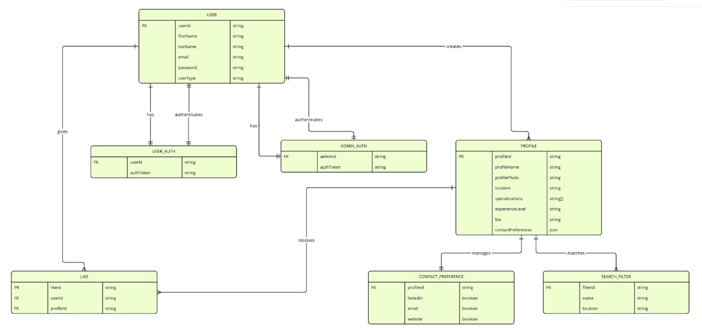
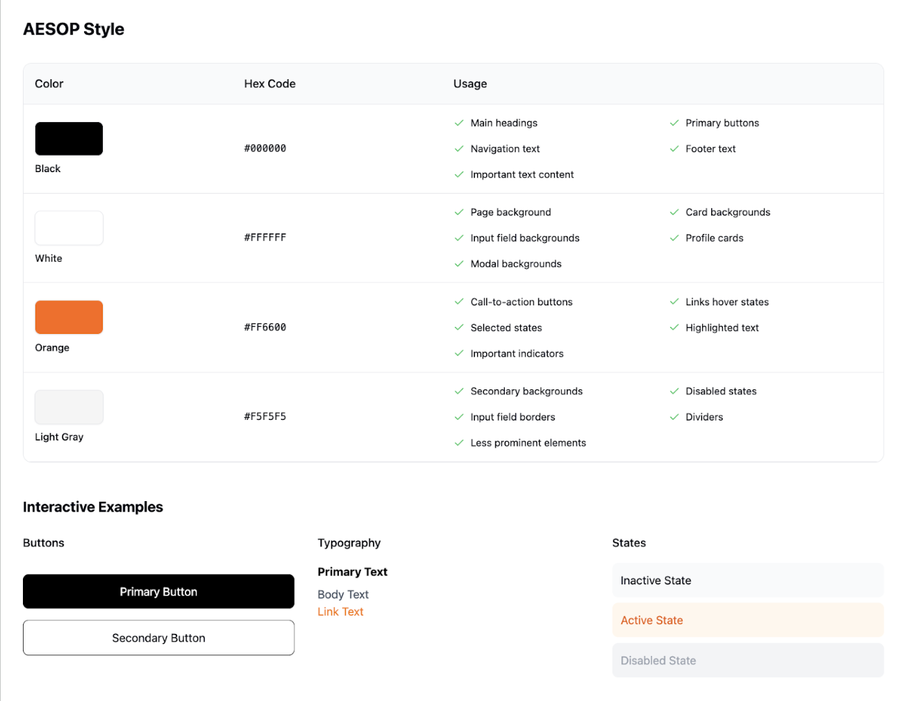
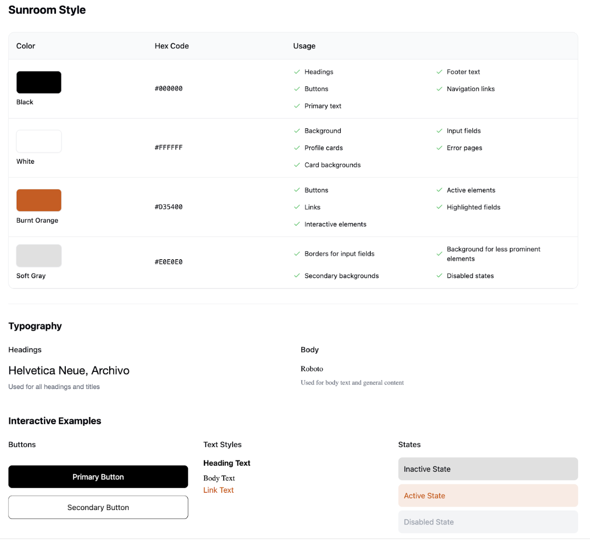
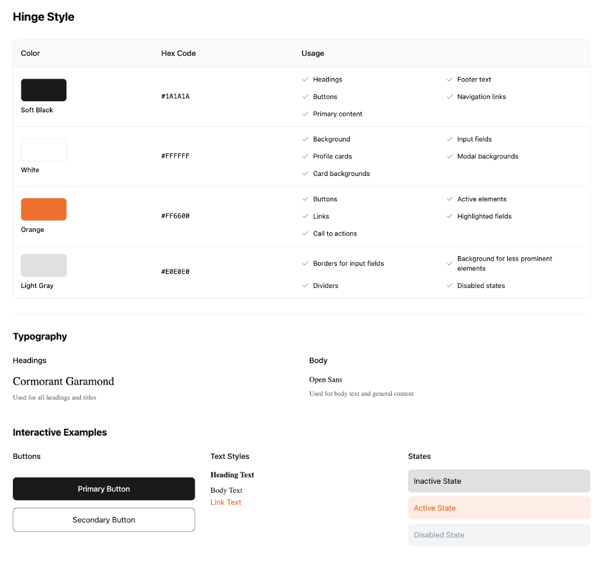

# Product Name - To Be Confirmed

# Table of Contents

[Mission Statement](#mission-statement)

[Features](#features)
- [Summary](#summary)
- [Users](#users)
- [Collections](#collections)
- [Pages/Endpoint Functionality](#pagesendpoint-functionality)
- [Nice To Haves](#nice-to-haves)

[Technical Implementation](#technical-implementation)
- [Back-End](#back-end)
- [Front-End](#front-end)
- [Git & Deployment](#git--deployment)

[Target Audience](#target-audience)
- [User Personas](#user-personas)
- [User Stories](#user-stories)

[Back-end Implementation](#back-end-implementation)
- [API Specification](#api-specification)
- [Database Schema](#database-schema)

[Front-end Implementation](#front-end-implementation)
- [Wireframes](#wireframes)
  - [Design Inspiration](#design-inspiration)
  - [Wireframes - Version 1](#wireframes---version-1)
  - [Wireframe - HOME](#wireframe---home)
  - [Wireframe - LOGIN](#wireframe---login)
  - [Wireframe - SIGNIN](#wireframe---signin)
  - [Wireframe - SHOWING RESULTS](#wireframe---showing-results)
  - [Wireframe - PROFILE](#wireframe---profile)
  - [Wireframe - CREATE PROFILE](#wireframe---create-profile)
  - [Wireframe - ERROR PAGE](#wireframe---error-page)
  - [Wireframe - PAGE NO RESULT](#wireframe---page-no-result)

[Style Guide](#style-guide)
- [Option 1: AESOP Style](#option-1-aesop-style)
  - [Typography](#typography)
  - [Color Palette](#color-palette)
  - [Interactive Elements](#interactive-elements)
- [Option 2: Sunroom Style](#option-2-sunroom-style)
  - [Typography](#typography-1)
  - [Color Palette](#color-palette-1)
  - [Interactive Elements](#interactive-elements-1)
- [Option 3: Hinge Style](#option-3-hinge-style)
  - [Typography](#typography-2)
  - [Color Palette](#color-palette-2)
  - [Interactive Elements](#interactive-elements-2)
- [Icons](#icons)
  - [Common Icons Used](#common-icons-used)

## Mission Statement

Empowering growth by connecting role models and opportunities in tech through a platform for collaboration and inclusivity.

## Features

### Summary
The web app will connect diverse individuals to panels and speaking opportunities by allowing:
- Profiles for speakers to showcase their experience and expertise
- Organizers to search and filter profiles effectively
- A user-friendly platform that balances accessibility and professionalism

### Users

| Type | Access | Role Type Assignment |
|------|---------|---------------------|
| Superuser/Admin | - Login, logout, and full profile management - Verify and delete inactive profiles - Update platform content - Manage user accounts - Access admin dashboard | Platform managers and administrators |
| Individual User | - Create and update personal profiles - Claim or request profile deletion - Login and logout - Filter and search profiles | Role models, diverse professionals seeking opportunities |
| Guest User | - View profiles - Search profiles but cannot contact without an account | Event organizers and general users exploring profiles |

### Collections

| Feature | Access | Notes/Conditions |
|---------|---------|-----------------|
| Profile Information | Admin, User | Name, title, role, specialization, experience levels (technical and speaking), location, bio, and contact |
| Profile Management | Admin, User | Profiles can be created by individuals or by nomination. Inactivity may lead to automatic deactivation |
| Search and Filter | Guests, Admin, User | Filter by specialization, location, experience levels |
| Profile Claiming | Admin, User | Users can claim a profile if created by someone else. Stretch goal for MVP |

### Pages/Endpoint Functionality

| Endpoint/Page | Functionality | Comments |
|--------------|---------------|-----------|
| Homepage | - Introduction to the platform - Create profile - Carousel of featured profiles - Search and filter functionality | Responsive design for desktop-first users |
| Profiles | - Individual profiles with detailed information - Continuous scroll for browsing profiles - Search and filter functionality | Key feature of the MVP |
| Profile | - Display detailed speaker information - Provide a "Contact Speaker" option (requires login) - Allow users to search and filter profiles - Allow guests to view profiles but restrict contacting | Key feature of the MVP. Profiles are searchable and filterable |
| Create profile | - Provide a form for users to input their details - Allow admins to create or edit profiles for others - Save profiles to the database - Validate inputs | Users can update their profiles after creation |
| Signup Page | - Enable new user registration - Validate email format and passwords - Include CAPTCHA (optional) - Redirect users to create profile | Email should be mandatory to activate an account |
| Admin Dashboard | - Manage all user and profile data - Delete inactive profiles | Admin access only |
| Login/Signup | - Create accounts - Manage login/logout | Required for contacting profiles |
| Profile Management | - Users can create and update their profiles - Admin can verify or delete profiles | Separate profile creation from account creation |

### Nice To Haves

- Profile likes and connection counts
- Animations for improved user experience
- Responsive design for mobile use
- Claim profiles feature
- Allow guests to view profiles without contact access

## Technical Implementation

### Back-End

- Django / DRF API
- Python

### Front-End

- React / JavaScript
- HTML/CSS

### Git & Deployment
- Heroku
- Netlify
- GitHub

This application's back-end will be deployed to Heroku. The front-end will be deployed separately to Netlify.
 
We will also use Insomnia to ensure API endpoints are working smoothly (we will utilise a local and deployed environment in Insomnia).

## Target Audience

Our platform serves two primary audience segments:

**Primary Audience:**
- Event organisers in the tech industry looking for women speakers and role models in tech
- Women in tech or transitioning into tech roles, seeking speaking opportunities, and expand their network
- Students and minority folks looking for inspiration and role models

**Secondary Audience:**
- Professionals seeking to build their personal brand and expand their professional network
- Students and early career professionals exploring tech career paths

### User Personas
| Persona | Name | Occupation | Goals | Challenges | Preferred Features | Quote |
|---------|------|------------|--------|------------|-------------------|--------|
| Guest/Student/Community Member | Priya Kapoor, 24 | Software Engineering Student | • Discover relatable role models in tech. • Learn about different career paths and specialisations. • Build confidence in pursuing a tech career. | • Lack of access to diverse representation in the tech industry. • Uncertainty about which specialisation to pursue. | • Browse functionality for profiles and success stories. • Insights into career paths. • Role models with relatable journeys. | *"I want to explore tech career options and find role models who inspire me."* |
| Speaker/Role Model | Emily Carter, 37 | AI Research Scientist | • Build a personal brand as an expert in the tech industry. • Inspire and mentor women in tech. • Be discovered for speaking opportunities. | • Limited time to manage outreach opportunities. • Difficulty showcasing expertise effectively online. | • Profile creation and editing tools. • Privacy controls for contact preferences. • Easy-to-use interface for highlighting expertise. | *"I want to inspire others while continuing to grow my professional network."* |
| Event Organiser | Camila Smith, 42 | Event Coordinator at TechTechy | • Find diverse, qualified speakers for tech events. • Streamline the speaker selection process. • Ensure a professional and engaging event experience. | • Difficulty finding speakers with specific expertise. • Limited time for manual searches and outreach. | • Advanced search filters (e.g., expertise, location). • Detailed speaker profiles with professional backgrounds. • Contact tools for outreach | *"I want to ensure our events feature speakers who inspire and engage the audience."* |

### User Stories
| User Type | User Stories | Requirements |
|-----------|--------------|--------------|
| Guest | *As a guest, I want to discover diverse role models in tech so that I can be inspired about potential career paths* | • Browse functionality • Featured profiles • Success stories • Career path visibility |
| Guest | *As a guest, I want to learn about different tech specialisations so that I can understand potential career options* | • Specialisation descriptions • Role model experiences • Career path insights • Industry information |
| Guest | *As a guest, I want to sign up easily so that I can personalise my experience and access premium features like direct contact.* | • Clear registration form • Required fields validation • Privacy policy acceptance • Clear indication of mandatory fields |
| Speaker/Role Model | *As a speaker, I want to create and manage profile(s) so that event organisers can find me for speaking opportunities* | • Registration functionality • Profile creation form • Profile editing capability • Required fields validation |
| Speaker/Role Model | *As a speaker/regular user, I want to showcase my areas of expertise so that I can be found for relevant speaking opportunities* | • Specialisation selection • Topics/SME areas input • Experience level indication • Professional background |
| Speaker/Role Model | *As a speaker, I want to manage my contact preferences so that I can be reached appropriately* | • Contact details input • Privacy settings • LinkedIn integration • Contact form preferences |
| Speaker/Role Model | *As a speaker, I want to delete my profile(s) so that I can remove my information from the platform if I'm no longer available for speaking opportunities* | • Profile deletion functionality • Confirmation process / deletion alert • Data removal notification |
| Event Organiser | *As an event organiser, I want to contact potential speakers so that I can discuss speaking opportunities* | • Contact Buttons • Contact mechanism • Professional messaging • Contact privacy • Response tracking |
| Event Organiser | *As an event organiser, I want to search for speakers based on specific criteria so that I can find appropriate speakers for my events* | • Search functionality • Multiple filter options: Name & Location • Experience level filtering |
| Event Organiser | *As an event organiser, I want to browse speaker profiles so that I can evaluate their suitability for my event* | • Profile viewing capability • Detailed information display • Professional background • Speaking history |
| Speaker/Organiser | *As a Speaker/Event Organiser, I want to delete my account so that I can remove all my profiles and information from the platform if I'm no longer interested in speaking opportunities* | • Account deletion functionality • Deletion confirmation steps • Warning about data loss |
| Admin | *As an admin, I want to manage and moderate content so that the platform maintains high quality and professionalism* | • Profile Deletion Functionality • Profile Editing Capability • Account Deletion Functionality • Account Editing Capability • Profile Creation Form • User Creation Form |

## Back-end Implementation
### API Specification
*WIP*

### Database Schema

## Front-end Implementation

### Wireframes

See V1 (completed Saturday 11 January 2025) of Wireframes [here](https://excalidraw.com/#room=c17972f48f4322229496,9WDLADVu3hiEHfNN1ABdPA)

#### Design Inspiration

#### Wireframes - Version 1

#### Wireframe - HOME

#### Wireframe - LOGIN

#### Wireframe - SIGNIN

#### Wireframe - SHOWING RESULTS

#### Wireframe - PROFILE

#### Wireframe - CREATE PROFILE

#### Wireframe - ERROR PAGE

#### Wireframe - PAGE NO RESULT

## Style Guide

### Option 1: AESOP Style

### Typography
#### Headings
- Font: Playfair Display
- Source: [Google Fonts - Playfair Display](https://fonts.google.com/specimen/Playfair+Display)
- Usage: Main headings, Navigation text, Important text content

#### Body Text
- Font: Inter
- Source: [Google Fonts - Inter](https://fonts.google.com/specimen/Inter)
- Usage: Body text and general content

### Color Palette
#### Primary Colors
- Black (`#000000`)
  - Usage: Main headings, Navigation text, Important text content, Primary buttons, Footer text

#### Secondary Colors
- White (`#FFFFFF`)
  - Usage: Page background, Input field backgrounds, Modal backgrounds, Card backgrounds, Profile cards

#### Accent Colors
1. Orange (`#FF6600`)
   - Usage: Call-to-action buttons, Selected states, Important indicators, Links hover states, Highlighted text
2. Light Gray (`#F5F5F5`)
   - Usage: Secondary backgrounds, Input field borders, Less prominent elements, Disabled states, Dividers

### Interactive Elements
- Primary Button (Black background, White text)
- Secondary Button (White background, Black border)
- States:
  - Inactive State (Light gray)
  - Active State (Orange background)
  - Disabled State (Light gray)

## Option 2: Sunroom Style

### Typography
#### Headings
- Font: Helvetica Neue or Archivo
- Sources: 
  - [Adobe Fonts - Helvetica Neue](https://fonts.adobe.com/fonts/helvetica-neue)
  - [Google Fonts - Archivo](https://fonts.google.com/specimen/Archivo)
- Usage: All headings and titles

#### Body Text
- Font: Roboto
- Source: [Google Fonts - Roboto](https://fonts.google.com/specimen/Roboto?query=ROBOTO)
- Usage: Body text and general content

### Color Palette
#### Primary Colors
- Black (`#000000`)
  - Usage: Headings, Buttons, Primary text, Navigation links, Footer text

#### Secondary Colors
- White (`#FFFFFF`)
  - Usage: Background, Profile cards, Card backgrounds, Input fields, Error pages

#### Accent Colors
1. Burnt Orange (`#D35400`)
   - Usage: Buttons, Links, Interactive elements, Active elements, Highlighted fields
2. Soft Gray (`#E0E0E0`)
   - Usage: Borders for input fields, Secondary backgrounds, Disabled states, Background for less prominent elements

### Interactive Elements
- Primary Button (Black background, White text)
- Secondary Button (White background, Black border)
- States:
  - Inactive State (Light gray)
  - Active State (Orange background)
  - Disabled State (Light gray)

## Option 3: Hinge Style

### Typography
#### Headings
- Font: Cormorant Garamond
- Source: [Google Fonts - Cormorant Garamond](https://fonts.google.com/specimen/Cormorant+Garamond)
- Usage: All headings and titles

#### Body Text
- Font: Open Sans
- Source: [Google Fonts - Open Sans](https://fonts.google.com/specimen/Open+Sans?query=OPEN+SANS)
- Usage: Body text and general content

### Color Palette
#### Primary Colors
- Soft Black (`#1A1A1A`)
  - Usage: Headings, Buttons, Primary content, Footer text, Navigation links

#### Secondary Colors
- White (`#FFFFFF`)
  - Usage: Background, Profile cards, Card backgrounds, Modal backgrounds, Input fields

#### Accent Colors
1. Orange (`#FF6600`)
   - Usage: Buttons, Links, Call to actions, Active elements, Highlighted fields
2. Light Gray (`#E0E0E0`) or Soft Orange (`#FFC299`)
   - Usage: Borders for input fields, Dividers, Background for less prominent elements, Disabled states

### Interactive Elements
- Primary Button (Soft Black background, White text)
- Secondary Button (White background, Soft Black border)
- Text Styles:
  - Heading Text
  - Body Text
  - Link Text (Orange)
- States:
  - Inactive State (Light gray)
  - Active State (Orange background)
  - Disabled State (Light gray)

## Icons
The following icon sets are available for use across all style options:
- [FontAwesome](https://fontawesome.com)
- [Feather Icons](https://feathericons.com)
- [Material Icons](https://fonts.google.com/icons)

### Common Icons Used
- Search Icon
- User Profile Icon
- Dropdown Icon
- Pagination Icons
- Error Icon
- Edit Icon
- Save Icon